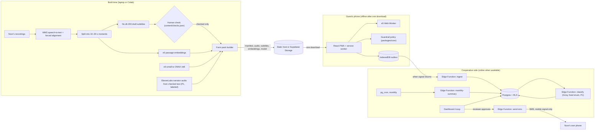

# Technical Requirements Document: Ask Noor

Version 1.0, October 3, 2026. Companion to `docs/PRD.md`. If they disagree, the PRD wins on what to build and this document wins on how.

## 1. Constraints from the brief, as engineering requirements

| Brief rule (section 06) | Engineering requirement |
|---|---|
| Runs on a device the user already has | Guests use their own phones (PWA). Noor uses her own phone for SMS only. Recording happens once on her daughter's smartphone. No new hardware. |
| Core feature works offline | Tour, ask flow, feedback and shop run with zero network after one pack download. Proven by a Playwright test with the browser context offline. |
| Model files small enough to side-load or send over a weak connection | One on-device model (multilingual-e5-small, int8). Size measured and reported; vocabulary trimming as P1. |
| One interaction in a named local language | Noor's recordings and Noor's monthly text are in her language (Wolof, or a labeled stand-in). |
| Human in the loop; avoid hallucinations | No generative model on the guest path. Guest confirms matches. Fixed templates for Noor. Reviewer approves sends. |
| Fail-safe ("not sure, ask a person") | Threshold and safety routing in `packages/core`, covered by tests. |

## 2. Architecture



**Where each AI component runs, and why**

| Component | Runs where | When | Why there |
|---|---|---|---|
| Meta MMS (speech-to-text, forced alignment) | Laptop or Colab | Once per recording batch | Large model; not needed on phones |
| NLLB-200 distilled 600M | Laptop or Colab | Once per content change | Drafts only; a person checks before guests see anything |
| multilingual-e5-small | Guest's phone, Web Worker | Every question | The only model on the device; can't generate text, only measure similarity |
| Groq (P1) | Supabase Edge Function | After sync | Cross-check themes for feedback; fixed enum output; never guest- or Noor-facing |
| ElevenLabs (P1) | Pipeline | Once per add-on change | Narrator audio from checked text, labeled; not Noor's voice |

## 3. Orchestration (key flows)

### 3.1 Build a farm pack
1. `content/<farm>/` holds scripts, add-ons, `checks.json`, test questions and raw recordings.
2. `transcribe` runs MMS with the farm's language adapter and forced alignment, producing word timestamps.
3. `segment` cuts clips into moments of 10–30 s at sentence boundaries.
4. `translate` creates draft subtitles for each visitor language with NLLB and marks them unchecked.
5. A person checks drafts and edits `checks.json`. Nothing is auto-approved.
6. `embed` encodes each moment as `passage: <checked text>` in every available language and stores normalized vectors.
7. `export_model` exports e5 to ONNX and quantizes to int8 (P1: vocabulary trimming).
8. `pack` writes `manifest.json`, audio (Opus), WebVTT subtitles, embeddings and model files, with sizes and SHA-256 checksums. In `--mode production`, unchecked items are excluded. In `--mode demo`, they're included and flagged.
9. `eval` calibrates the match threshold on the test set, writes it into the manifest, and writes `docs/EVAL.md`.

### 3.2 Ask a question (guest's phone, offline)
1. `AskBox` sends the text to `AskService.ask(text)`.
2. `decideSafety(text)` runs first, using the normalized multilingual lexicon. If it trips, the outcome is `safety`, nothing is stored, and the matcher is never called.
3. The `Matcher` (worker) embeds `query: <text>` and returns the top 3 moments with cosine scores.
4. `decide(results, thresholds)`: below `match`, the outcome is `saved`. Otherwise `confirm` with the top moment. (P1: if top minus second is below `margin`, show "Is it about A or B?")
5. On `confirm`, the guest taps Yes to play that moment, or No to save the question. On `saved`, the item goes to the outbox with a device-assigned theme.

### 3.3 Sync
1. `SyncService` listens for the `online` event and also retries with exponential backoff.
2. It posts outbox batches (at most 50 items) to the `ingest` function using the anon key.
3. `ingest` validates with Zod, redacts emails and phone numbers, and upserts on client UUID, so retries never duplicate.
4. On success, the client marks items synced. They stay on the device until then.

### 3.4 Monthly report and text message
1. `pg_cron` calls `monthly-summary` on the first of each month (and the dashboard can trigger it).
2. It counts guests, orders, items, the top loved theme, the top asked theme with count, and the top wished-for theme.
3. It fills the checked template for Noor's language. If the template or any theme label in her language is unchecked, the status is `held`.
4. A reviewer reads the preview in `/coop` and approves. Only then does `send-sms` send it, or log it in demo mode.

### 3.5 Noor records a new answer
1. Noor records the answer (clip 8 in the demo). The pipeline rebuilds the pack as version n+1.
2. The service worker detects the new manifest when online and updates the cached pack. The UI shows "Noor added a new answer."

## 4. Stack

| Layer | Choice | Reason |
|---|---|---|
| Package manager | Bun 1.3.x | Fast installs; workspaces; one tool for scripts |
| Tooling runtime | Node.js 24 LTS | Active LTS today; Node 26 becomes LTS later in October 2026. Node 16 is end-of-life. |
| UI | React 19.2, TypeScript strict | Current stable React |
| Build | Vite with `@vitejs/plugin-react` | Fast; first-class PWA plugin |
| Styling | Tailwind CSS v4 | Design tokens as CSS variables |
| Components | Animate UI (shadcn CLI registry; uses Motion) | Accessible, animated primitives we own in our repo |
| Signature animation | GSAP 3 | One timeline: subtitle progress synced to audio |
| State | Zustand (guest), TanStack Query (coop) | Small, testable stores; cached server reads |
| Local storage | Dexie on IndexedDB | Durable outbox and pack metadata |
| Offline | vite-plugin-pwa (Workbox) | Precached shell; runtime-cached pack |
| QR | qr-scanner | Uses the native BarcodeDetector where available, with a worker fallback |
| On-device AI | `@huggingface/transformers` (Transformers.js) with multilingual-e5-small ONNX int8 | Runs in a worker; local files only |
| Backend | Supabase: Postgres, RLS, Edge Functions (Deno), Auth, Storage, pg_cron | One managed backend for data, auth, functions and scheduling |
| Validation | Zod (client, functions, Groq output) | One schema language end to end |
| Cloud LLM (P1) | Groq, strict JSON schema (a GPT-OSS model for strict mode; Kimi K2 only with best-effort parsing and validation) | Fast classification into a fixed enum |
| Voice (P1) | ElevenLabs text-to-speech, build time | Narrator audio for add-ons in visitor languages |
| Pipeline | Python 3.12, uv, transformers, torch, torchaudio (MMS forced aligner), optimum[onnxruntime], sacrebleu, jiwer, pytest | Standard, reproducible |
| Quality | Biome, Vitest, Testing Library, Playwright, Deno test | Fast, Bun-friendly |
| CI | GitHub Actions with `oven-sh/setup-bun`, uv | Runs checks on every push |

Pin exact versions in the lockfiles on install day. Before adding any dependency, check it's maintained and needed.

## 5. Repository structure

```
ask-noor/
├── CLAUDE.md
├── README.md
├── package.json                 # Bun workspaces: apps/*, packages/*
├── biome.json
├── .env.example
├── .github/
│   ├── copilot-instructions.md
│   └── workflows/ci.yml
├── tasks/
│   ├── todo.md
│   └── lessons.md
├── docs/
│   ├── PRD.md
│   ├── TRD.md
│   ├── PROJECT_MEMORY.md
│   ├── DATA_CARD.md             # datasets, licenses, sizes, gaps (Preet)
│   ├── RESPONSIBLE_AI.md        # guardrails, privacy, consent, bias (Preet)
│   ├── EVAL.md                  # generated by pipeline/eval
│   └── DEMO.md                  # video script
├── content/
│   └── ondera-noor/
│       ├── clips.json           # scripts, stop codes, topics
│       ├── addons.json          # facts (with sources), recipe, products, farm card
│       ├── checks.json          # who checked what, when
│       ├── templates.json       # Noor-language text templates and theme labels
│       ├── test-questions.csv   # question, lang, expected_moment or NOT_COVERED, synthetic flag
│       └── recordings/          # raw audio (gitignored if large)
├── packages/
│   └── core/
│       ├── package.json
│       └── src/
│           ├── types.ts         # all shared contracts
│           ├── text/normalize.ts
│           ├── guardrails/
│           │   ├── safety.ts    # lexicon + decideSafety()
│           │   ├── decide.ts    # threshold and confirm logic
│           │   └── gating.ts    # checked-content rules (shared with pipeline via JSON)
│           ├── themes/themes.ts # fixed theme taxonomy (IDs + keyword hints)
│           ├── sms/template.ts  # fill checked templates with counts only
│           ├── i18n/            # interface strings per visitor language
│           └── index.ts
│       └── test/                # Vitest: guardrails, templates, normalization
├── apps/
│   └── web/
│       ├── index.html
│       ├── vite.config.ts       # React, Tailwind, PWA
│       ├── playwright.config.ts
│       ├── e2e/                 # offline tour, ask outcomes, order, sync
│       └── src/
│           ├── main.tsx
│           ├── app/             # routes, providers, error boundary
│           ├── features/
│           │   ├── pack/        # download, status, update banner
│           │   ├── tour/        # StopList, StopScanner, Player, Subtitles
│           │   ├── ask/         # AskBox, ConfirmCard, SavedCard, SafetyCard
│           │   ├── feedback/
│           │   ├── shop/        # ProductCard, OrderSheet
│           │   ├── cards/       # RecipeCard, FarmCard, FunFact
│           │   └── coop/        # Dashboard, Insights, ReviewQueue, SmsPreview, Orders
│           ├── services/        # interfaces + implementations (see section 6.2)
│           ├── workers/e5.worker.ts
│           ├── animations/      # GSAP timelines, reduced-motion guard
│           ├── components/ui/   # Animate UI components (shadcn CLI)
│           ├── lib/             # supabase client, env, formatting
│           └── styles/          # Tailwind v4 theme tokens
├── supabase/
│   ├── config.toml
│   ├── migrations/              # schema, RLS, cron
│   ├── seed.sql                 # labeled synthetic month for the demo
│   └── functions/
│       ├── _shared/             # zod schemas, redaction, cors, supabase admin client
│       ├── ingest/
│       ├── classify/            # P1, Groq
│       ├── monthly-summary/
│       └── send-sms/
└── pipeline/
    ├── pyproject.toml           # uv
    ├── asknoor/
    │   ├── config.py
    │   ├── transcribe.py
    │   ├── segment.py
    │   ├── translate.py
    │   ├── embed.py
    │   ├── export_model.py
    │   ├── tts_addons.py        # P1, ElevenLabs
    │   ├── audio.py
    │   ├── pack.py
    │   ├── build.py             # orchestrates the steps above
    │   └── eval/                # matching, translation, asr, threshold, report
    └── tests/
```

## 6. Module specifications

### 6.1 `packages/core` (pure, no I/O, no React)

```ts
export type VisitorLang = 'en' | 'de' | 'nl' | 'sv';
export type NoorLang = 'wo' | 'gu';
export type ThemeId =
  | 'stay' | 'food' | 'buy' | 'price' | 'path' | 'kids' | 'roast' | 'picking'
  | 'story' | 'view' | 'welcome' | 'taste' | 'length' | 'wifi' | 'transport' | 'other';

export interface Moment {
  id: string;                       // "c3-m1"
  clipId: number;
  startMs: number; endMs: number;
  subtitles: Partial<Record<VisitorLang, string>>; // production packs contain checked text only
  topic: Partial<Record<VisitorLang, string>>;     // short label for the confirm card
  draft?: Partial<Record<VisitorLang, boolean>>;   // demo packs only
}

export interface Clip { id: number; kind: 'stop' | 'answer'; stopCode?: string; audio: string; durationMs: number; momentIds: string[] }

export interface FarmPackManifest {
  packId: string; farmId: string; version: number; mode: 'production' | 'demo'; createdAt: string;
  noorLang: NoorLang; visitorLangs: VisitorLang[];
  clips: Clip[]; moments: Moment[]; addons: Addon[];
  model: { id: 'multilingual-e5-small'; dir: string; dim: 384; quantization: 'int8'; vocab: 'full' | 'trimmed'; sizeBytes: number };
  embeddings: { file: string; count: number; dim: 384; dtype: 'float32' };
  thresholds: { match: number; margin: number };   // calibrated by pipeline/eval
  sizes: Record<string, number>; checksums: Record<string, string>;
  labels: { standIn: string[]; syntheticVoice: string[] };
}

export interface MatchResult { momentId: string; score: number }
export type AskOutcome =
  | { kind: 'safety' }
  | { kind: 'confirm'; momentId: string; score: number }
  | { kind: 'saved'; reason: 'below-threshold' | 'ambiguous' | 'guest-said-no' };

export type OutboxItem =
  | { type: 'question'; id: string; farmId: string; lang: VisitorLang; text: string; deviceTheme: ThemeId; createdAt: string }
  | { type: 'feedback'; id: string; farmId: string; lang: VisitorLang; loved?: string; change?: string; lovedTheme?: ThemeId; changeTheme?: ThemeId; createdAt: string }
  | { type: 'order'; id: string; farmId: string; items: { productId: string; qty: number }[]; total: number; currency: string; confirmedByNoor: true; createdAt: string };
```

Required functions, each with unit tests:

- `normalize(text)`: lowercase, `ß` to `ss`, strip diacritics, collapse non-alphanumerics to spaces, pad with spaces for whole-word matching.
- `decideSafety(text): boolean`: whole-word match against the multilingual lexicon (English, German, Dutch, Swedish at minimum). Conservative by design: a false positive sends a guest to the guide, which is safe.
- `decide(results, thresholds): AskOutcome`: pure; no side effects.
- `themeOf(text): ThemeId`: device-side keyword hints for the fixed taxonomy (the cooperative cross-checks with Groq in P1).
- `fillTemplate(template, counts, labels): string`: only known placeholders; throws on unknown placeholders or missing checked labels.

### 6.2 `apps/web`: SOLID boundaries

| Principle | How it shows up |
|---|---|
| Single responsibility | Components render. Hooks hold view state. Services do I/O. `packages/core` decides. |
| Open/closed | New matcher strategies implement `Matcher`. No changes to callers. |
| Liskov substitution | `E5WorkerMatcher` and the test `FakeMatcher` are interchangeable in every test. |
| Interface segregation | Small interfaces: `Matcher`, `PackRepository`, `Outbox`, `SyncService`, `Scanner`, `AudioPlayer`. |
| Dependency inversion | Components get services from a `ServicesProvider` context, built once in `main.tsx`. Tests inject fakes. |

```ts
export interface Matcher { ready(): Promise<void>; match(text: string, k?: number): Promise<MatchResult[]> }
export interface PackRepository { current(): Promise<FarmPackManifest | null>; download(onProgress: (p: number) => void): Promise<FarmPackManifest>; checkForUpdate(): Promise<boolean> }
export interface Outbox { add(item: OutboxItem): Promise<void>; pending(): Promise<OutboxItem[]>; markSynced(ids: string[]): Promise<void>; count(): Promise<number> }
export interface SyncService { start(): void; stop(): void; syncNow(): Promise<{ sent: number; failed: number }> }
export interface Scanner { start(video: HTMLVideoElement, onCode: (code: string) => void): Promise<void>; stop(): void }
export interface AudioPlayer { load(src: string): Promise<void>; play(fromMs?: number, toMs?: number): void; stop(): void; onTime(cb: (ms: number) => void): () => void }
```

Routes: `/` (guest tour), `/coop` (sign-in required), `/coop/review`, `/coop/report`. Error boundary shows a plain recovery message and never a stack trace.

### 6.3 Matcher worker

- Loads Transformers.js with `env.allowRemoteModels = false` and `env.localModelPath` set to the pack's model directory, so it can never fetch a model from the internet.
- On load: model plus the moment embedding matrix (Float32Array, normalized).
- On query: embed `query: <text>` with mean pooling and normalization, then compute dot products against the matrix and return the top k.
- Warm-up on pack load with a dummy query, so the first real question is fast.
- Reports timings to the UI in demo mode only.

### 6.4 Offline and PWA

- Workbox precaches the app shell. The farm pack is fetched once into a named cache (`pack-<farmId>-v<version>`) through `PackRepository.download`, which verifies SHA-256 checksums from the manifest.
- The manifest is checked for updates when online. A new version downloads in the background and swaps in on the next stop change, never mid-clip.
- Storage: request persistent storage (`navigator.storage.persist()`) after download, and tell guests to download shortly before the tour, since iOS Safari may clear site data after a period of non-use.

### 6.5 Animation and theme

- **One signature animation:** a GSAP timeline that advances the subtitle progress indicator in sync with the audio's `timeupdate`. Under `prefers-reduced-motion`, it switches to an instant state change (`gsap.matchMedia`).
- **Everything else:** Animate UI's built-in Motion transitions for dialogs, sheets and buttons. No scroll-triggered entrance animations.
- **World Bank–inspired tokens (palette only, never the logo or any implied endorsement):**

| Token | Value | Use |
|---|---|---|
| `--wb-navy` | `#002244` | Text, headings, primary surfaces in dark mode |
| `--wb-cyan` | `#009FDA` | Fills, icons, focus rings, large text only |
| `--surface` | `#F5F8FB` | Page background (light) |
| `--line` | `#D6E1EA` | Borders |
| `--ok`, `--draft`, `--safety` | Pick from the World Bank secondary palette | Status only |

  Contrast: `#009FDA` on white is about 3:1, so it fails AA for body text. Use navy text on cyan fills (about 5.3:1) for primary buttons.

- **Type:** subtitles and body in Atkinson Hyperlegible (designed for legibility; include a system fallback). Headings in an Arial-compatible stack, matching the World Bank guideline pairing of Andes and Arial without licensing Andes.

### 6.6 Supabase

**Schema (migration `0001_init.sql`):**

```sql
create table farms (
  id uuid primary key default gen_random_uuid(),
  name text not null,
  cooperative text,
  noor_lang text not null check (noor_lang in ('wo','gu')),
  created_at timestamptz not null default now()
);

create table coop_members (
  user_id uuid not null references auth.users on delete cascade,
  farm_id uuid not null references farms on delete cascade,
  role text not null check (role in ('admin','reviewer')),
  primary key (user_id, farm_id)
);

create table questions (
  id uuid primary key,                       -- client-generated, makes ingest idempotent
  farm_id uuid not null references farms,
  lang text not null check (lang in ('en','de','nl','sv')),
  text text not null check (char_length(text) between 1 and 500),
  device_theme text not null,
  cloud_theme text,                          -- P1, Groq
  final_theme text,                          -- set when themes agree or a reviewer decides
  created_at timestamptz not null,
  synced_at timestamptz not null default now(),
  is_synthetic boolean not null default false
);

create table feedback (
  id uuid primary key,
  farm_id uuid not null references farms,
  lang text not null check (lang in ('en','de','nl','sv')),
  loved text check (char_length(loved) <= 500),
  change text check (char_length(change) <= 500),
  loved_theme text, change_theme text,
  cloud_loved_theme text, cloud_change_theme text,
  created_at timestamptz not null,
  synced_at timestamptz not null default now(),
  is_synthetic boolean not null default false,
  check (loved is not null or change is not null)
);

create table orders (
  id uuid primary key,
  farm_id uuid not null references farms,
  items jsonb not null,
  total integer not null check (total >= 0),
  currency text not null default 'GMD',
  confirmed_by_noor boolean not null check (confirmed_by_noor),
  created_at timestamptz not null,
  synced_at timestamptz not null default now(),
  is_synthetic boolean not null default false
);

create table content_checks (
  farm_id uuid not null references farms,
  key text not null,                         -- e.g. clip:3:de, fact:1:en, template:monthly:wo
  checked boolean not null default false,
  checked_by uuid references auth.users,
  checked_at timestamptz,
  primary key (farm_id, key)
);

create table sms_templates (
  farm_id uuid not null references farms,
  lang text not null,
  key text not null,                         -- 'monthly' or 'theme:<id>'
  body text not null,
  checked boolean not null default false,
  primary key (farm_id, lang, key)
);

create table monthly_reports (
  id uuid primary key default gen_random_uuid(),
  farm_id uuid not null references farms,
  period date not null,                      -- first day of the month
  counts jsonb not null,
  body text,
  status text not null check (status in ('held','ready','approved','sent','failed')),
  approved_by uuid references auth.users,
  sent_at timestamptz,
  unique (farm_id, period)
);
```

**RLS (migration `0002_rls.sql`):** enable RLS on every table. Anonymous users have no direct table access; guest data enters only through `ingest`, which uses the service role on the server. Cooperative members can read their farm's rows. Reviewers can update `content_checks` and resolve themes. Only admins can set `monthly_reports.status = 'approved'`.

```sql
create function is_member(f uuid) returns boolean language sql stable as
$$ select exists (select 1 from coop_members m where m.user_id = auth.uid() and m.farm_id = f) $$;

alter table questions enable row level security;
create policy "members read questions" on questions for select using (is_member(farm_id));
-- same pattern for feedback, orders, content_checks, sms_templates, monthly_reports
```

**Edge Functions (Deno, TypeScript):**

| Function | Input | Behavior | Output |
|---|---|---|---|
| `ingest` | `{ farmId, items: OutboxItem[] }` (at most 50) | Zod validation; redact emails and phone numbers; upsert on id; reject unknown farm | `{ accepted: string[], rejected: { id, reason }[] }` |
| `classify` (P1) | Rows lacking a cloud theme | Groq call with a strict JSON schema; Zod-validate; on failure, leave null | Updates `cloud_*` columns; disagreements go to the review queue |
| `monthly-summary` | `{ farmId, period }` | Counts from synced rows; `fillTemplate` with checked template and labels; `held` if anything is unchecked | Upserts `monthly_reports` |
| `send-sms` | `{ reportId }` | Requires `approved`. Provider adapter; with `SMS_MODE=demo`, it logs instead of sending | Status `sent` or `failed` |

`pg_cron`: at 06:00 on the first of each month, call `monthly-summary` for every farm.

### 6.7 Groq (P1, cooperative side only)

- Endpoint: OpenAI-compatible chat completions at `api.groq.com`.
- Model: configurable via `GROQ_MODEL`. Prefer a model that supports strict JSON schema mode (GPT-OSS 20B or 120B at the time of writing). Kimi K2 supports structured outputs on a best-effort basis, so use it only with Zod validation and a fallback.
- Request: temperature 0; a system message telling it to choose exactly one theme ID from the enum or `other`; `response_format` with `json_schema` `{ theme: enum[...] }`, `additionalProperties: false`, strict.
- Input: redacted text, truncated to 500 characters. Disclose in `RESPONSIBLE_AI.md` that anonymous feedback text is sent to Groq.
- Output never reaches guests or Noor directly. It only feeds the review queue and counts that a reviewer approves.

### 6.8 ElevenLabs (P1, build time only)

- `pipeline/asknoor/tts_addons.py` converts checked add-on text in each visitor language into narrator audio with a stock voice. No cloning.
- Files are listed in `manifest.labels.syntheticVoice`, and the UI shows "AI narrator voice" next to them.
- Optional evaluation: compare ElevenLabs speech-to-text against MMS on the same recordings, and report both.

### 6.9 Pipeline (Python)

- `transcribe.py`: `facebook/mms-1b-all` with the farm's language adapter (for example `wol` or `guj`), then torchaudio's MMS forced aligner for word timestamps.
- `translate.py`: `facebook/nllb-200-distilled-600M`, FLORES-200 codes (`wol_Latn`, `guj_Gujr`, `eng_Latn`, `deu_Latn`, `nld_Latn`, `swe_Latn`). Output is always draft.
- `embed.py`: `intfloat/multilingual-e5-small`, prefix `passage: `, mean pooling, L2-normalized.
- `export_model.py`: ONNX export plus dynamic int8 quantization (P1: vocabulary trimming to the languages in use, with a check that accuracy stays within 2 points).
- `pack.py`: production or demo mode, sizes, checksums, labels.
- `eval/`: matching accuracy and confusion; threshold sweep choosing the lowest threshold that keeps false confirmations at or below 5%; FLORES-200 chrF for Noor's language versus a better-supported one; word error rate against typed transcripts; latency profile. Writes `docs/EVAL.md`.
- Licenses to record in the data card: MMS and NLLB are CC-BY-NC 4.0; multilingual-e5-small is MIT.

## 7. Contracts

**Ingest request**

```json
{ "farmId": "uuid", "items": [ { "type": "question", "id": "uuid", "farmId": "uuid", "lang": "de", "text": "Kann man hier übernachten?", "deviceTheme": "stay", "createdAt": "2026-10-03T20:15:00Z" } ] }
```

**Groq response schema**

```json
{ "type": "object", "properties": { "theme": { "type": "string", "enum": ["stay","food","buy","price","path","kids","roast","picking","story","view","welcome","taste","length","wifi","transport","other"] } }, "required": ["theme"], "additionalProperties": false }
```

**Monthly template (English preview; Noor's language version must be checked)**

```
This month: {guests} guests shared feedback. {orders} orders ({items} items). Loved: {loved}. Most asked: {asked} ({askedCount}). Most wished for: {wished}.
```

Rules: only these placeholders; theme labels come from checked `sms_templates` rows; target one SMS segment (160 GSM-7 characters), never more than two.

## 8. Guardrails: implementation and tests

| Guardrail | Implementation | Tests |
|---|---|---|
| Answers only from Noor's recordings | No generative calls in `apps/web`; the matcher returns moment IDs only | Lint rule banning LLM SDK imports in `apps/web`; unit tests |
| Guest confirms | Confirm card is the only path from question to playback | e2e: question, then Yes required before playback |
| Fail-safe | `decide()` with calibrated threshold | Unit tests at, above and below the threshold; eval fail-safe rate |
| Safety routing | `decideSafety()` before the matcher; not stored | Multilingual cases; outbox unchanged after a safety question |
| Checked content only | Pack builder excludes unchecked items in production | pytest on `pack.py`; e2e on a production pack |
| Noor decides | Order requires confirmation; reports require approval; new answers require a recording | Unit and function tests |
| Privacy | Redaction in `ingest`; no personal fields in schema; RLS | Deno tests for redaction; RLS denies anonymous reads |
| Labels | Manifest labels drive UI badges | Component tests |

## 9. Performance budgets

| Item | Budget |
|---|---|
| Initial JavaScript (gzipped, guest route) | 250 KB or less, excluding the worker and model |
| Farm pack | Measured and reported; P0 at most 150 MB, P1 at most 50 MB |
| Time from question to outcome | 800 ms or less median on a mid-range Android after warm-up |
| Model first load | 5 s or less on a mid-range Android |
| Lighthouse (guest route) | PWA installable; accessibility 95 or higher |

## 10. Security and privacy

- Anonymous clients can only call `ingest`. Every table has RLS enabled. The service-role key exists only inside Edge Functions.
- `ingest` redacts emails and phone numbers before storing, limits payload size, and rejects unknown farms.
- No names, phone numbers, emails or precise locations are collected. Orders store product IDs, quantities and totals only.
- The Content Security Policy allows only our origin, the Supabase project and the pack host. The guest app makes no other network calls.
- Secrets: `.env` is gitignored. `.env.example` lists names only.

## 11. Testing and verification

| Layer | Tool | Must cover |
|---|---|---|
| Core | Vitest | Normalization, safety (4 languages), decide thresholds, themes, template filling |
| Web components | Vitest and Testing Library | Confirm, saved and safety cards; order sheet; labels |
| End to end | Playwright | Download pack, go offline, play stop, ask (confirm, saved, safety), feedback, order, come back online, sync |
| Functions | Deno test | Ingest validation, redaction, idempotency; summary held versus ready; send requires approval |
| Pipeline | pytest | Segmentation, pack gating in production, checksums |
| Evaluation | `pipeline/eval` | Numbers in `docs/EVAL.md`, regenerated before submission |

The offline test is the single most important test. Run it before every checkpoint.

## 12. Environment variables

| Name | Where | Notes |
|---|---|---|
| `VITE_SUPABASE_URL`, `VITE_SUPABASE_ANON_KEY` | `apps/web` | Anon key only |
| `VITE_FARM_ID`, `VITE_PACK_BASE_URL`, `VITE_DEMO_MODE` | `apps/web` | Demo mode shows labeled drafts |
| `SUPABASE_SERVICE_ROLE_KEY` | Edge Functions secrets | Never in the client |
| `GROQ_API_KEY`, `GROQ_MODEL` | Edge Functions secrets | P1 |
| `SMS_MODE` (`demo` or `live`), provider keys | Edge Functions secrets | Demo mode logs only |
| `ELEVENLABS_API_KEY` | Pipeline `.env` | P1, build time only |
| `HF_HOME` | Pipeline | Model cache location |

## 13. Judging criteria to technical evidence

| Criterion | Evidence we will show |
|---|---|
| Small AI fidelity (25%) | Offline Playwright run and on-camera airplane-mode demo; pack size; on-device latency |
| Development relevance (20%) | Monthly text from real synced items; orders; overnight-stay idea from saved questions |
| Data grounding (15%) | `DATA_CARD.md`: every dataset with source, license, size and gaps |
| Evidence it works (15%) | `EVAL.md`: accuracy, fail-safe rate, translation and transcription scores |
| Clarity, design, AI value (15%) | Explanation of why a menu or spreadsheet can't do this; accessible UI |
| Scalability (10%) | Pipeline per farm and language; cooperative dashboard for many farms |
| Responsible AI (pass/fail) | Section 8 tests, `RESPONSIBLE_AI.md` |

## 14. Risks and fallbacks

| Risk | Fallback |
|---|---|
| Matcher worker not ready by the 8 PM checkpoint | Temporary `KeywordMatcher` implementing `Matcher`, labeled as a stand-in in demo mode; replaced before submission |
| Model too large | Int8 plus side-load; vocabulary trimming as P1 |
| Supabase or SMS provider issues | Demo-mode logging; seed data labeled synthetic |
| Groq unavailable | Device themes only; classification stays P1 |
| Time pressure | Apply the cut list in `tasks/todo.md` in order |
